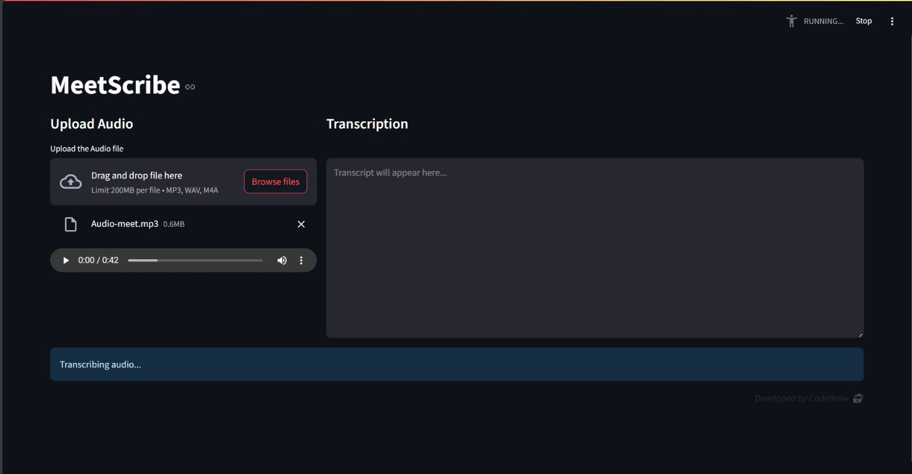

# MeetScribe
MeetScribe is an AI-powered meeting companion that listens to your meeting recordings and provides all the essential details and takeaways you need—summaries, action items, and sentiment analysis, so you never miss out anything.  

## How to run it:
1. Open the `meetscribe.ipynb` in a google colab notebook.
2. The web app runs with the help of ngrok which requires you to sign up and obtain an authentication token from their [website](https://dashboard.ngrok.com/signup).
3. Run the code blocks in the order as present in the notebook and be sure to enter the ngrok authentication token in place of _<YOUR_AUTHTOKEN>_ in the line `ngrok.set_auth_token("YOUR_AUTHTOKEN")`.
4. Finally you will be provided with a randomly generated URL with a _funny_ name along with an ip address as the password. Open the link and use the IP address provided by the code to unlock the website.
5. You now have access to MeetScribe and can upload your meeting recordings and see the AI-powered meeting companion work its magic!

_Developed by CodeBrew 🤖_
